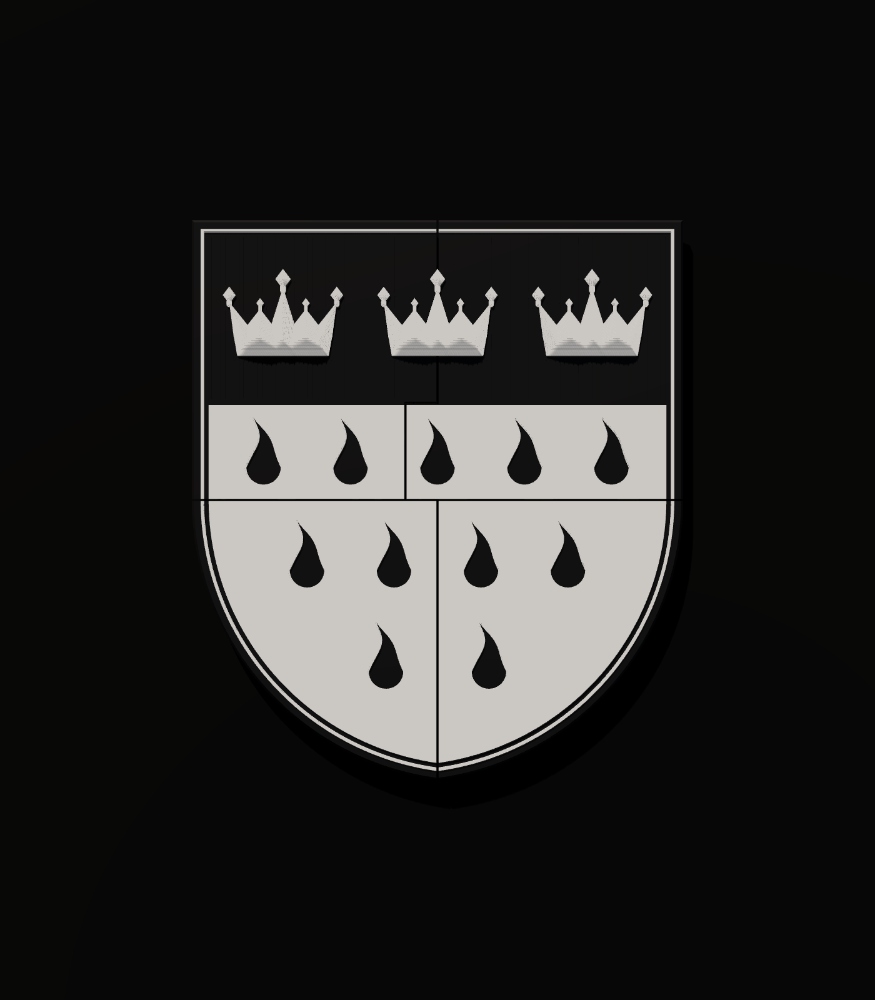
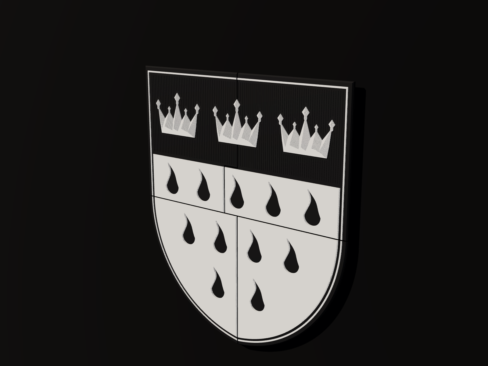
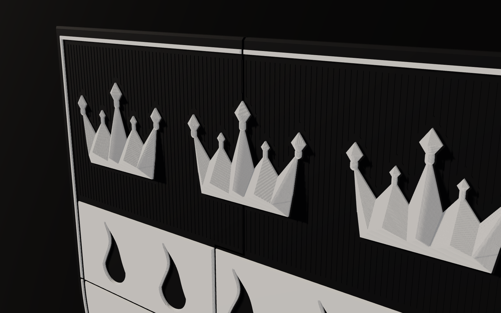
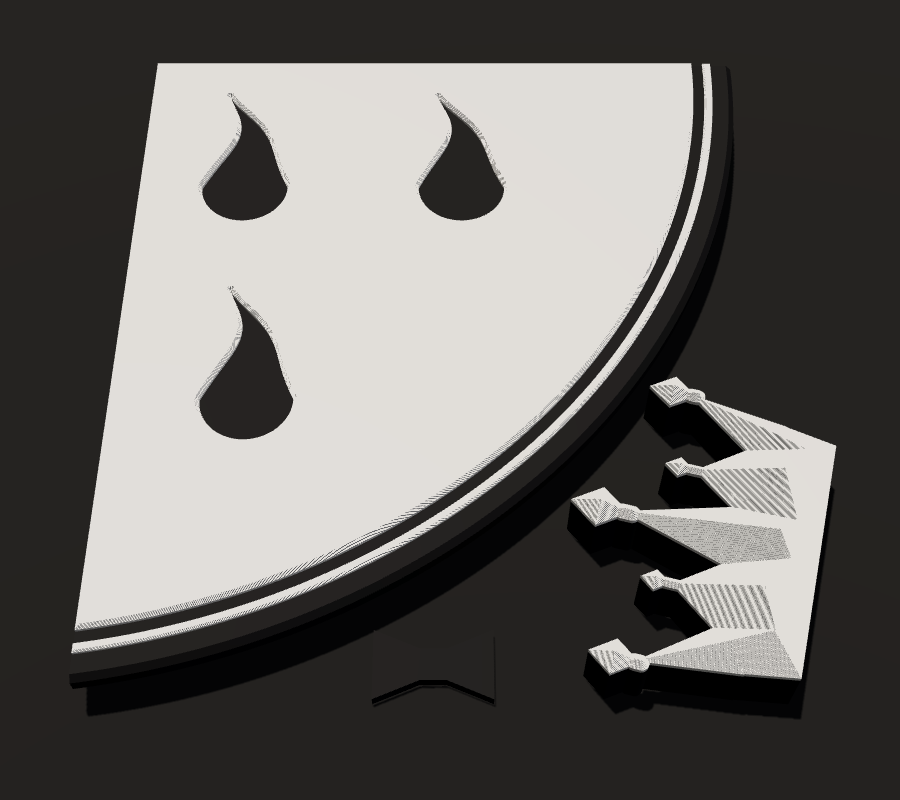

# Kölner Stadtwappen als schwebendes Wandrelief in Schwarz/Weiß



**Größe:** 43 × 49 cm, 2,0 cm tief, Kronen 3,2 cm · **4 Druckplatten** (256-mm-Bett, Bambu X1C/P1S/A1) · **1 Farbwechsel pro Platte**

## Designidee

- **Wappen nach Blasonierung:** Unter dem Schildhaupt mit drei Kronen stehen elf Flammen im Verhältnis **5 : 4 : 2**.
- **Farben übersetzt:** Rot wird Schwarz, Gold und Silber werden Weiß.
  - Das schwarze Schildhaupt verschmilzt mit der schwarzen Wand, die weißen Kronen scheinen zu schweben.
- **Heraldische Schraffur:** Im Schildhaupt verlaufen feine senkrechte Rillen. Das ist die klassische Schwarz-Weiß-Kennzeichnung für *Rot* (Petra-Sancta-System).
  - Man sieht sie nur im Streiflicht, wer es weiß, erkennt sie.
- **Kronen:** Sie sind facettiert wie geschliffene Steine, mit Walmdach-Schliffflächen und Rauten-Perlen, und fangen das Licht.
- **Flammen:** Sie sind als scharfkantige Aussparungen aus der 2,4 mm starken weißen Feldplatte geschnitten.
  - Jede Kante hat eine 45°-Fase.
  - Die Farbgrenze entsteht aus Geometrie, nicht aus Farbmischung. So bleiben die Kanten messerscharf.
- **Weiße Konturlinie:** Sie läuft 8 mm innerhalb der Schildkante.
- **Kanten:** Die Vorderkante hat eine 45°-Fase wie gefräst. Darunter schneidet ein 12-mm-Unterschnitt ein.
  - Dadurch schwebt der Schild mit einer Schattenkante vor der Wand.
- **Fugen:** Die 2-mm-Fugen sind bewusst als Steinfugen gestaltet und laufen nur zwischen den Motiven.
  - Im oberen Feldband springt die Fuge zur Seite und weicht so der Mittelflamme aus, wie bei einem Mauerverband.
  - Die mittlere Krone ist ein eigener Zapfen. Sie sitzt über der Fuge und verriegelt beide oberen Kacheln.




## Dateien (`out/`)

| Platte | Inhalt | Datei |
|---|---|---|
| 1 | Kachel oben links | `platte_1_komplett.stl` |
| 2 | Kachel oben rechts | `platte_2_komplett.stl` |
| 3 | Kachel unten links + 7 Schwalbenschwanz-Schlüssel | `platte_3_komplett.stl` |
| 4 | Kachel unten rechts + Kronen-Zapfen (Mitte) + 1 Schlüssel | `platte_4_komplett.stl` |

- Alle Teile liegen bereits richtig positioniert auf der 256-mm-Platte.
- Die Kalibrierzone des X1C vorne links ist frei.
- Zusätzlich gibt es zu jeder Platte `_schwarz.stl` und `_weiss.stl`, falls du lieber mit Teile-Zuweisung arbeitest.
- Einzelteile liegen in `out/teile/`.
- Das zusammengebaute Wappen liegt in `wappen_gesamt_*.stl`.

## Drucken (Bambu Studio)

**Der Trick:** Alles unterhalb von **18,2 mm** ist schwarz, alles darüber weiß. Deshalb genügt ein einziger Farbwechsel.

1. Öffne `platte_N_komplett.stl`.
   - Fragt das Programm, ob es als ein Objekt mit mehreren Teilen geladen werden soll, wähle **Ja**.
   - Lass die Position unverändert, nicht automatisch anordnen.
2. Wähle als Filament 1 **Schwarz** (Startfarbe).
3. Slicen. Dann im Schicht-Schieberegler zur Schicht bei **18,20 mm** gehen, Rechtsklick wählen, dann *Filament wechseln* und **Filament 2 (Weiß)**.
   - Das AMS wechselt automatisch.
4. Empfohlene Einstellungen:
   - **Material:** PLA Matte, *Charcoal* und *Ivory White*. Matt wirkt deutlich hochwertiger als glänzend.
   - **Schichthöhe:** 0,12 mm, Erstschicht 0,2 mm. Dann liegt der Wechsel exakt auf einer Schichtgrenze.
     - 0,08 / 0,2 / 0,24 mm funktionieren auch, keine variable Schichthöhe.
   - **Wände:** 3, Reihenfolge *außen/innen* (Outer/Inner), damit die Außenkanten präziser werden.
   - **Decke:** 6 Schichten, Boden 4. **Füllung:** 10 % Gyroid.
   - **Ironing:** *Top surfaces*. Das glättet die schwarze Schildhaupt-Fläche und die weißen Deckflächen.
   - **Stützen:** keine. Alle Überhänge sind 45°-Fasen.
   - **Druckbett:** Textured PEI.
   - **Naht:** *Back* bzw. *Aligned*.
5. Grob geschätzter Materialbedarf: insgesamt ca. 1,0–1,2 kg Schwarz und 0,3 kg Weiß, also 2 Spulen Schwarz und 1 Spule Weiß. Bambu Studio zeigt dir nach dem Slicen die genauen Werte.

## Montage

1. Lege die Kacheln mit der Vorderseite nach unten auf eine weiche, saubere Unterlage.
2. Setze die 8 **Schwalbenschwanz-Schlüssel** in die Taschen auf der Rückseite und klebe sie mit etwas 2K-Epoxid oder Sekundenkleber ein. So werden die 4 Kacheln zu einem steifen Schild.
3. Drehe den Schild um. Setze den **Kronen-Zapfen** von vorn in die Aussparung über der Mittelfuge und fixiere ihn mit einem Tropfen Kleber.
4. **Wandmontage:** Bring 3M-VHB-Klebeband (19 mm) oder tesa Powerstrips auf die Rückseite auf, als Kreuz entlang der Fugen plus Streifen an den Rändern.
   - Das Gewicht liegt bei etwa 1,3–1,5 kg. Wähle Klebestreifen mit mindestens 3 kg Tragkraft.
   - Wandfarbe vorher entfetten. Bei frischer oder kreidender Farbe lieber 2 Schrauben durch die Rückseite setzen und mit Spachtel verdecken.
5. **Optionaler Lichtkranz:** Klebe einen warmweißen COB-LED-Streifen (2700 K) 15–20 mm innerhalb der Rückseiten-Kante auf.
   - Er strahlt an der Fase vorbei auf die schwarze Wand und lässt das Wappen schweben. Das sieht spektakulär aus.

## Anpassen

Alle Maße stehen als Parameter oben in `generate.py`, zum Beispiel Größe, Fugenbreite, Reliefhöhen, Schraffur an/aus und Bett-Sperrzonen. Neu erzeugen mit:

```bash
pip install shapely manifold3d trimesh numpy
python3 generate.py
```

Das Skript prüft automatisch:
- Alle Netze sind geschlossen.
- Weiß liegt nur oberhalb, Schwarz nur unterhalb von 18,2 mm.
- Alle Teile passen auf das Bett.

Das Ergebnis steht in `out/report.json`.


