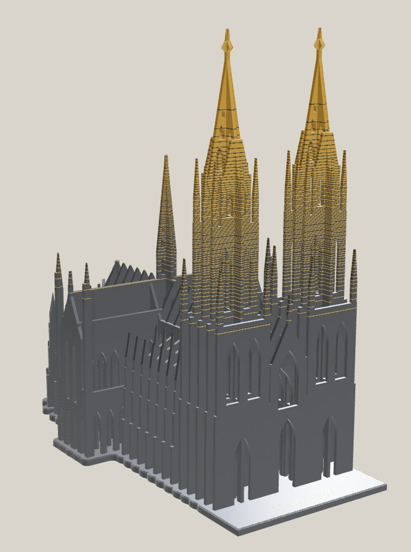
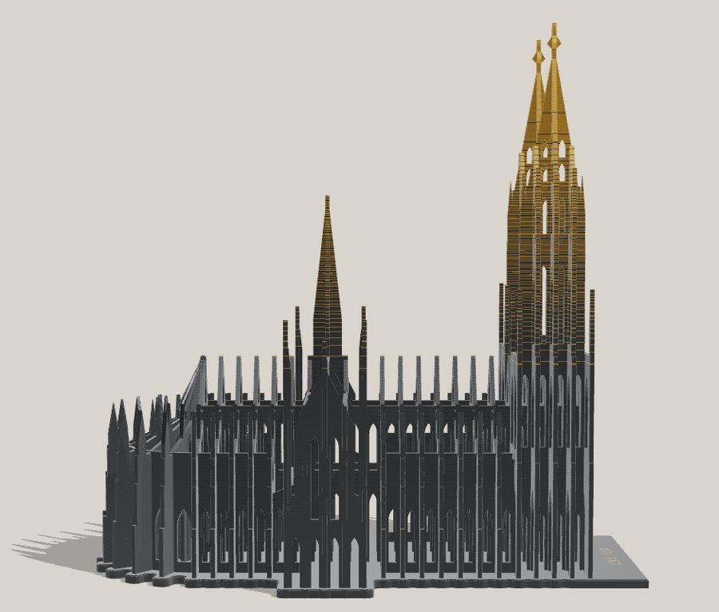
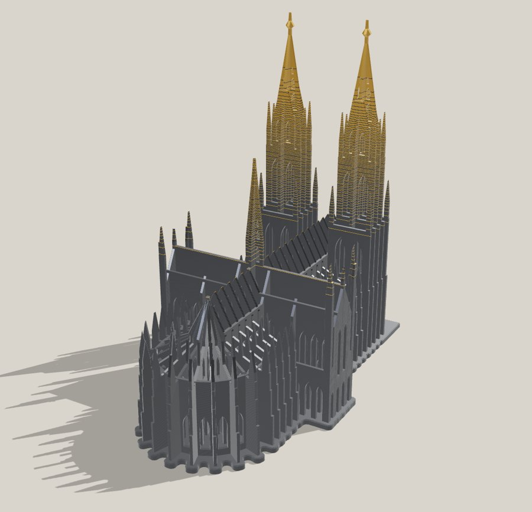
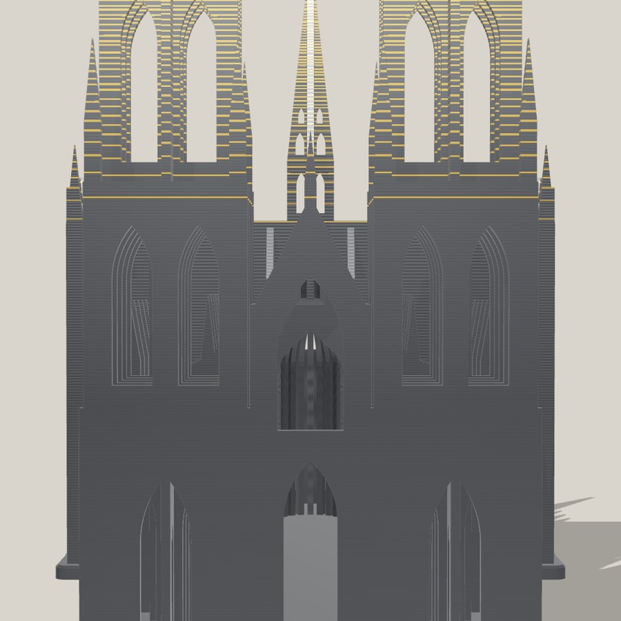

# Kölner Dom · DURCHBLICK

Ein 3D-Druck-Deko-Objekt. Der Dom wird nicht nachgebaut, sondern in sein gotisches
Gerippe zerlegt: 52 senkrechte Lamellen, jede ein Querschnitt durch den Dom an der
Stelle eines Strebepfeilers. Unten bleibt er dunkler Stein, nach oben wird er
Schicht für Schicht zu Gold.



| Rheinseite | Chor | Durchblick |
|---|---|---|
|  |  |  |

## Die Idee

- **Lamellen statt Mauern.** Von der Seite ergeben die Scheiben die Silhouette, die man
  vom Rhein aus kennt. Von schräg vorne wird daraus ein Rhythmus aus Licht und Schatten.
- **Durchblick.** Alle Spitzbögen liegen exakt hintereinander. Durch Hauptportal und
  Giebelfenster schaut man durch das ganze Langhaus bis in den Chor.
- **Der Chor fächert auf.** Um die Apsis stehen die Lamellen strahlenförmig, wie das
  Strebewerk am echten Chorhaupt.
- **Vom Stein ins Gold.** Der Farbverlauf liegt in den Druckschichten: erst einzelne
  Goldlinien, dann immer dichter, bis Turmhelme und Kreuzblumen ganz golden sind.
- **Gotik druckt ohne Stützen.** Jeder Spitzbogen läuft oben in 45° aus. Das ganze
  Objekt braucht keine einzige Stütze.
- **1248 · 1880.** Grundsteinlegung und Vollendung als goldene Inschrift auf der
  Domplatte vor der Westfassade.

## Maße

| | |
|---|---|
| Höhe | 203 mm (Turm 200 mm + Sockel 3,08 mm) |
| Grundfläche | 115 × 205 mm, passt auf 256er Bambu-Platten (X1, P1, A1) |
| Maßstab | ≈ 1 : 787 (157 m Turmhöhe → 200 mm) |
| Lamellen | 1,6 mm stark, ein zusammenhängender Körper |
| Schichten | erste 0,20 mm, danach 0,16 mm |
| Stützen | keine, Überhänge höchstens 45° |
| Material | grob 250 g Filament A, rund 10 g Filament B plus Spülmenge |

## Dateien (`out/`)

| Datei | Wofür | Filamentwechsel |
|---|---|---|
| `dom_durchblick_A.stl` + `dom_durchblick_B.stl` | **Feinlinien** (Standard): Goldlinien je 2 Schichten | ≈ 156 |
| `dom_durchblick_A_lagenweise.stl` + `dom_durchblick_B_lagenweise.stl` | **Lage für Lage**: weichster Übergang | ≈ 306 |
| `dom_durchblick_einfarbig.stl` | ein Filament, ohne AMS | 0 |

Teil A ist das dunkle Filament (Sockel, Kirchenschiff, untere Türme), Teil B das Gold
(Goldlinien, Turmspitzen, Inschrift).

## Farbpaare

| Name | Filament A | Filament B |
|---|---|---|
| Abendgold | Bambu PLA Silk+ Titan Gray | Bambu PLA Silk+ Gold |
| Bronze | Bambu PLA Metal Iron Gray Metallic | Bambu PLA Metal Iridium Gold Metallic |
| Kupfer | Bambu PLA Metal Iron Gray Metallic | Bambu PLA Metal Copper Brown Metallic |
| Blaue Stunde | Bambu PLA Metal Cobalt Blue Metallic | Bambu PLA Silk+ Silver |

## Drucken in Bambu Studio

1. `dom_durchblick_A.stl` und `dom_durchblick_B.stl` **gleichzeitig** importieren und die
   Frage, ob es ein Objekt mit mehreren Teilen ist, mit **Ja** beantworten.
2. In der Objektliste Teil A dem dunklen Filament zuweisen, Teil B dem Gold.
3. **Erste Schicht 0,20 mm, danach 0,16 mm, variable Schichthöhe aus.** Die Goldlinien sind
   genau auf diese Schichten gerechnet.
4. 3 Wandlinien (die Lamellen werden massiv), 15 % Füllung (betrifft nur den Sockel),
   keine Stützen, kein Brim.
5. Prime-Turm aktiv lassen und hinter das Chorhaupt schieben.
6. Silk-Außenwände um 60 mm/s für mehr Glanz, Mindestschichtzeit etwa 8 s für saubere
   Turmspitzen, Z-Hop eingeschaltet lassen.

Die Mehrzeit durch die Filamentwechsel liegt grob bei 2–3 Stunden (Feinlinien) bzw.
4–6 Stunden (Lage für Lage), der Spülabfall bei etwa 50–80 g bzw. 100–150 g.

**Nicht im Slicer skalieren**, sonst liegen die Goldlinien nicht mehr auf den Schichten.
Für eine andere Größe (z. B. A1 mini) die Dateien neu erzeugen:

```bash
pip install numpy manifold3d matplotlib
python3 dom_durchblick.py --height 165            # Turmhöhe in mm
python3 dom_durchblick.py --run 1 --suffix _lagenweise
python3 dom_durchblick.py --grad-start 0.3 --grad-end 0.9 --run 3
python3 dom_durchblick.py --text ""               # ohne Inschrift
```

Alle Parameter: `python3 dom_durchblick.py --help`.
