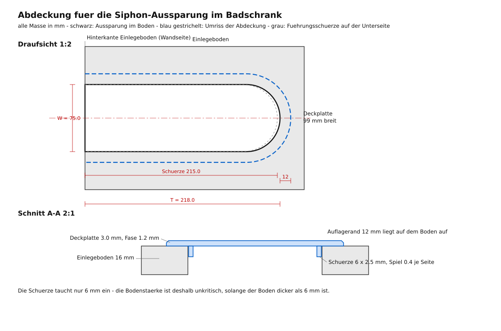

# Abdeckung für die Siphon-Aussparung (Badezimmer-Unterschrank)

Der Einlegeboden im Waschbecken-Unterschrank hat einen U‑förmigen Ausschnitt
für den Siphon. Da der Siphon nicht so weit herunterreicht, wird der
Ausschnitt nicht gebraucht — dieses Teil deckt ihn ab.

**Bitte zuerst den Testdruck machen.** Die Maße stammen aus den Fotos
(Zollstock im Bild) und sind auf ±2–3 mm genau. Der Testdruck dauert ~1 h,
kostet ~25 g Filament und liefert die exakten Maße für den finalen Druck.



## Angenommene Maße

| Maß | Wert | Quelle / Sicherheit |
|---|---|---|
| Breite der Aussparung | **75 mm** | Foto mit quer angelegtem Zollstock, abgelesen 7,4–7,8 cm → unsicher ±2 mm |
| Tiefe (Hinterkante Boden → Scheitel der Rundung) | **218 mm** | Zollstock längs, Ablesung ~22 cm; unklar, ob die 0 an der Fliese oder an der Bodenkante lag → unsicher ±10 mm |
| Radius der Rundung | **37,5 mm** | = halbe Breite (die Rundung ist ein sauberer Halbkreis, vermutlich Lochsäge) |
| Bodenstärke | 16 mm | geschätzt, **unkritisch** — die Führungsschürze taucht nur 6 mm ein |

## Aufbau der Abdeckung

* **Deckplatte 3 mm** mit umlaufender Fase (1,2 mm), liegt mit einem
  **12 mm breiten Rand** oben auf dem Boden auf — sie kann also nicht
  durchfallen und deckt Sägekanten mit ab.
* **Führungsschürze 6 × 2,5 mm** auf der Unterseite, taucht mit 0,4 mm Spiel
  je Seite in den Ausschnitt und hält die Platte seitlich in Position.
* **Zwei Querrippen** gegen Durchbiegen.
* Hinten (Wandseite) endet die Platte bündig mit der Bodenkante, dort gibt
  es keinen Auflagerand — der Ausschnitt ist ja zur Rückseite offen.
* Kein Loch für das Rohr: Das Chromrohr endet ca. **30 mm über** der
  Bodenoberfläche (bestätigt), die 3 mm dicke Platte kommt ihm also nicht
  in die Quere — auch der 12 mm breite Auflagerand nicht.

## Dateien

| Datei | Zweck |
|---|---|
| `stl/testdruck_komplett.stl` | **Zuerst drucken.** Alle drei Lehren auf einer Platte (161 × 145 mm) |
| `stl/testdruck_breitenlehre.stl` | Stufenlehre 71–79 mm, misst die lichte Breite |
| `stl/testdruck_bogenlehre.stl` | prüft den Radius vorne und dient der Tiefenmessung |
| `stl/testdruck_profilprobe.stl` | 40 mm langes Stück des echten Profils: Spiel, Auflagerand, Schürze |
| `stl/abdeckung_1teilig.stl` | fertige Abdeckung am Stück, 99 × 230 mm (Druckbett ≥ 235 mm nötig) |
| `stl/abdeckung_2teilig_vorne.stl` | vorderes Teil mit Rundung, 99 × 135 mm |
| `stl/abdeckung_2teilig_hinten.stl` | hinteres Teil, 99 × 109 mm — steckt per Schwalbenschwanz im vorderen Teil |
| `generate.py` | parametrischer Generator, erzeugt alle STLs neu |
| `massskizze.svg` | bemaßte Zeichnung (Draufsicht + Schnitt) |

Die 2‑teilige Variante ist für kleine Druckbetten (ab 150 × 150 mm) und
lässt sich auch leichter einsetzen. Die Schwalbenschwanz-Fuge hat 0,2 mm
Spiel; bei Bedarf mit einem Tropfen Sekundenkleber fixieren.

## So läuft der Testdruck ab

1. **`testdruck_komplett.stl` drucken** — liegend, keine Stützen, 0,2 mm
   Schichthöhe, 3 Perimeter, 15 % Infill.
2. **Breitenlehre:** mit dem schmalen Ende (71) senkrecht in den Ausschnitt
   stecken und langsam nach unten schieben. Sie rutscht hinein, bis eine
   Stufe zu breit ist. → *Die letzte Zahl, die noch durchgeht, ist die
   lichte Breite in mm.* Bitte auch sagen, ob diese Stufe stramm oder
   locker war.
3. **Bogenlehre:** vorne in den Ausschnitt legen, bis die Rundung rundum
   anliegt. Passt der Radius (kein Spalt, kein Kippeln)? Dann von der
   **Hinterkante der Lehre** bis zur **Hinterkante des Bodens** messen und
   **60 mm addieren** → das ist die exakte Tiefe.
4. **Profilprobe:** irgendwo in den geraden Bereich des Ausschnitts legen.
   Sitzt sie ohne Wackeln, ohne Klemmen? Steht der 3‑mm‑Rand störend über?
5. **Die drei Werte durchgeben** (Breite, Tiefe, Sitz der Profilprobe) —
   dann kommt die finale Datei mit exakten Maßen.

## Finale Datei mit korrigierten Maßen erzeugen

```bash
pip install trimesh shapely manifold3d mapbox_earcut scipy networkx rtree
python3 generate.py --width 74.5 --depth 214 --board 16
```

Alle STLs und die Maßskizze werden damit neu geschrieben. Weitere Parameter
(Randbreite, Plattendicke, Spiel, Fase, Teilung) stehen oben in `generate.py`
in der Klasse `Params`.

## Druckeinstellungen (Empfehlung)

| | |
|---|---|
| Material | PETG oder PLA (weiß passt zum Boden), PETG ist im Bad etwas robuster |
| Schichthöhe | 0,2 mm |
| Perimeter | 3 |
| Boden/Deckel | je 4 Schichten |
| Infill | 15–20 % (Gyroid) |
| Stützen | **keine** — die Teile sind so orientiert, dass nichts überhängt |
| Orientierung | **nicht drehen**: die glatte Sichtfläche liegt bereits auf dem Druckbett, Schürze und Rippen zeigen nach oben |

Materialbedarf finale Abdeckung: ca. 55–65 g, Druckzeit ca. 3 h.

## Noch offen

Nur noch die drei Werte aus dem Testdruck (Breite, Tiefe, Sitz der
Profilprobe) — die Rohrhöhe ist mit ~30 mm geklärt.

Falls das Rohr doch einmal durch den Boden geführt werden soll, kann in
`generate.py` eine hintere Öffnung ergänzt werden — momentan ist die
Fläche komplett geschlossen.
